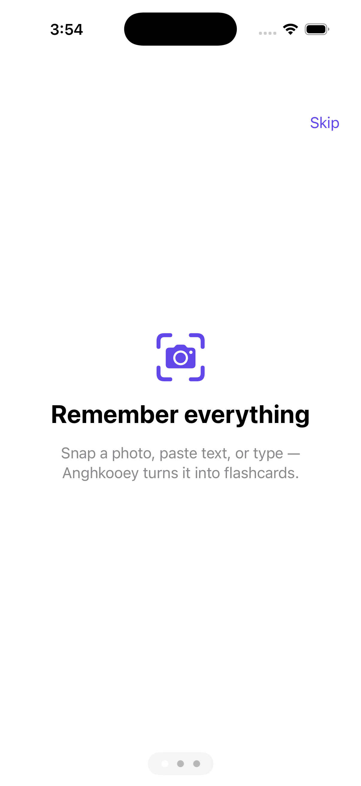
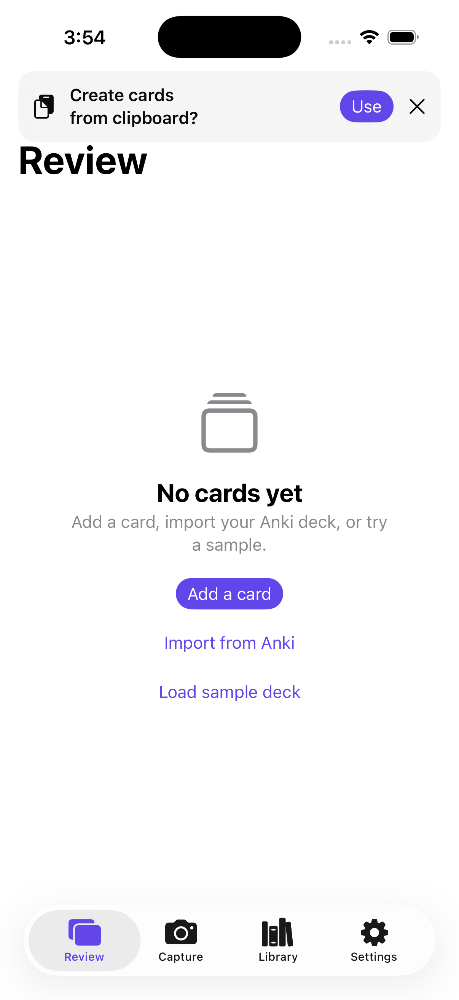

# Anghkooey — *remember everything*

**Anghkooey** is a capture-first, privacy-first spaced-repetition app for iOS 26. It removes the card-authoring tax: capture text, a photo, or a paste, and on-device Apple Intelligence (FoundationModels) turns it into well-formed flashcards, which a grace-first FSRS-6 scheduler then surfaces exactly when you're about to forget them. Every card stays on your device and in your own iCloud private database — no servers, no tracking, no third-party SDKs.

<p align="center">
  
  &nbsp;&nbsp;
  
</p>

> Screenshots captured on the iOS 26 simulator. App Store screenshots (populated review deck, library with tag chips, capture flow) are produced on Apple-Intelligence hardware as part of the submission step.

**Stack:** iOS 26 · Swift 6 (strict concurrency) · SwiftUI · FoundationModels · FSRS-6 · SwiftData + CloudKit · App Intents · WidgetKit · Vision OCR · SPM modules (`AnghkooeyCore` / `AnghkooeyIntelligence` / `AnghkooeyUI`)

See [`foundation.md`](foundation.md) for the authoritative product spec and v1 scope, and [`ARCHITECTURE.md`](ARCHITECTURE.md) for the engineering record.

---

## What it is

- **Capture-first.** Snap a photo, share a web selection, paste text, or type. The Share Extension and a cross-process inbox mean capture works from anywhere in iOS, even when the app isn't open.
- **On-device AI authoring.** `LanguageModelSession` + `@Generable` draft atomic Q&A and cloze cards from raw passages. Nothing is sent off device; airplane mode degrades gracefully to an editable stub.
- **Grace-first scheduling.** A from-scratch FSRS-6 port schedules reviews, with a "freeze" mechanism that shifts due dates forward instead of punishing you for a missed day.

## Highlights for engineers

Each bullet is backed by code, tests, or a written artifact in this repo:

- **FSRS-6 implemented from scratch** in pure-Swift `AnghkooeyCore`, validated by a **150-fixture parity harness** generated from the pinned reference implementation [`ts-fsrs` v5.4.0 (commit `80bab01`)](https://github.com/open-spaced-repetition/ts-fsrs) to an epsilon of `1e-9` on stability and difficulty. → [`Packages/AnghkooeyCore/Tests/.../Fixtures/fsrs6-parity.json`](Packages/AnghkooeyCore/Tests/AnghkooeyCoreTests/Fixtures/fsrs6-parity.json)
- **FoundationModels card-authoring pipeline** with `@Generable` output types and a streaming draft UI, gated by a **20-fixture rubric eval harness** (atomicity / specificity / groundedness / leakage) that runs offline-safe in CI. → [`AnghkooeyIntelligence`](Packages/AnghkooeyIntelligence)
- **SwiftData migrations across five versioned schemas (V1 → V5)**, namespaced per Apple's `VersionedSchema` pattern, covering cloze cards, optimization logs, and tags added across milestones.
- **SPM 3-module split with enforced boundaries.** `AnghkooeyCore` has no SwiftUI/Intelligence dependency; `AnghkooeyIntelligence` imports Core for logging only — enforced by [`scripts/m1-forbidden-patterns.sh`](scripts/m1-forbidden-patterns.sh), not convention.
- **Swift 6 strict concurrency (`complete`)** across all three modules, including actor-isolated stores, a `@MainActor` delegate-bridge pattern for capture, and `nonisolated` App Intent metadata.
- **App Intents + Siri/Spotlight donation, an interactive WidgetKit widget with grade reconciliation, and opt-in CloudKit private-DB sync** — each with its own ADR ([ADR-0010](docs/adr/ADR-0010-widget-grade-reconciliation.md), [ADR-0011](docs/adr/ADR-0011-cloudkit-private-sync.md)).
- **Vision OCR** (`VNRecognizeTextRequest`) feeding the same authoring pipeline as typed and shared text.
- **MetricKit + `os_signpost` instrumentation** with a committed [`PERFORMANCE.md`](PERFORMANCE.md) recording measured baselines.
- **Swift Testing as the primary suite** — **107 tests across 28 suites**, including parameterized parity and rubric tests. XCTest is reserved for latency measurement.

## Architecture

```
AnghkooeyUI            ← SwiftUI views, ViewModels, capture & review screens
  ├── AnghkooeyCore           ← SwiftData schema, FSRS-6 engine, inbox, stores (pure logic)
  └── AnghkooeyIntelligence   ← FoundationModels authoring, OCR, eval harness
        └── AnghkooeyCore      (logging only)
```

`AnghkooeyCore` is the dependency floor: it knows nothing about SwiftUI or the AI layer, so the scheduler and schema are testable in isolation. The app target composes the three modules. Full per-milestone decisions, package topology, and the FSRS parameter set live in [`ARCHITECTURE.md`](ARCHITECTURE.md).

## Performance

Capture and review paths emit `OSSignposter` intervals on the `com.mitsheth.anghkooey` subsystem; baselines are recorded in [`PERFORMANCE.md`](PERFORMANCE.md). Representative numbers:

| Interval | p50 | p95 | Budget | Gate |
|---|---|---|---|---|
| `review-tap` (grade-submit, CPU path) | 0.021 ms | 0.163 ms | < 100 ms | ✅ |
| `share-tap-to-inbox-write` | 9 ms | — (avg 13 ms) | — | — |

On-device latency-sensitive paths run far under their interaction budgets; the AI-draft and 30-minute soak baselines are captured on Apple-Intelligence hardware per [`docs/EVALS/device-qa-session.md`](docs/EVALS/device-qa-session.md).

## Privacy — Required-Reason API Audit

Apple requires apps to declare a reason for accessing certain sensitive APIs in their privacy manifest (`PrivacyInfo.xcprivacy`). Every required-reason API used by Anghkooey and its declared reason code:

| API category | Reason code | Where used | Justification |
|---|---|---|---|
| `NSPrivacyAccessedAPICategoryFileTimestamp` | `3B52.1` | `InboxDrainer` (main app) | Reads `contentModificationDateKey` and `attributesOfItem` on inbox JSON/image files the app creates and manages in the App Group container, to process items in arrival order. |
| `NSPrivacyAccessedAPICategoryFileTimestamp` | `DDA9.1` | `InboxWriter` (Share Extension) | Checks the inbox for existing pending items written from content shared by other apps via the Share Sheet. |
| `NSPrivacyAccessedAPICategoryUserDefaults` | `CA92.1` | Main app (`OnboardingState`, `SyncPreference`, `FreezeController`, `ClipboardCaptureCoordinator`) | App's own settings only: onboarding-completed flag, iCloud sync opt-in, freeze state, clipboard-offer dedupe. No third-party access. |

**APIs audited and confirmed not used:**

| API category | Status |
|---|---|
| `NSPrivacyAccessedAPICategorySystemBootTime` | Not used — no `systemUptime`, `mach_absolute_time`, or monotonic clock calls in production code |
| `NSPrivacyAccessedAPICategoryDiskSpace` | Not used — no `volumeAvailableCapacity` or `attributesOfFileSystem` calls |
| `NSPrivacyAccessedAPICategoryActiveKeyboards` | Not used — no `UITextInputMode.activeInputModes` calls |

**No tracking, no third-party SDKs, no data collection.** All card data stays on-device in SwiftData; opt-in CloudKit sync stays in the user's private iCloud account.

## Build & test

The repo uses xcodegen; the Xcode project is generated from [`App/project.yml`](App/project.yml). The simulator ID below drifts — re-verify with `xcodebuild -showdestinations -project App/Anghkooey.xcodeproj -scheme Anghkooey`.

```bash
# Generate the project (after cloning or editing project.yml)
make generate && python3 scripts/patch_privacy_info.py

# Build
xcodebuild build -project App/Anghkooey.xcodeproj \
  -scheme Anghkooey -destination "id=<SIM_ID>" \
  -derivedDataPath /tmp/anghkooey-derived-data \
  CODE_SIGN_IDENTITY="-" CODE_SIGNING_REQUIRED=NO CODE_SIGN_STYLE=Manual

# Test (Swift Testing primary suite — 107 tests / 28 suites)
xcodebuild test -project App/Anghkooey.xcodeproj \
  -scheme Anghkooey -destination "id=<SIM_ID>" \
  -derivedDataPath /tmp/anghkooey-derived-data \
  CODE_SIGN_IDENTITY="-" CODE_SIGNING_REQUIRED=NO CODE_SIGN_STYLE=Manual
```

> Note: the FoundationModels eval harness and AI card-authoring require an Apple-Intelligence-capable device; on the simulator the AI paths degrade to editable stubs by design.
